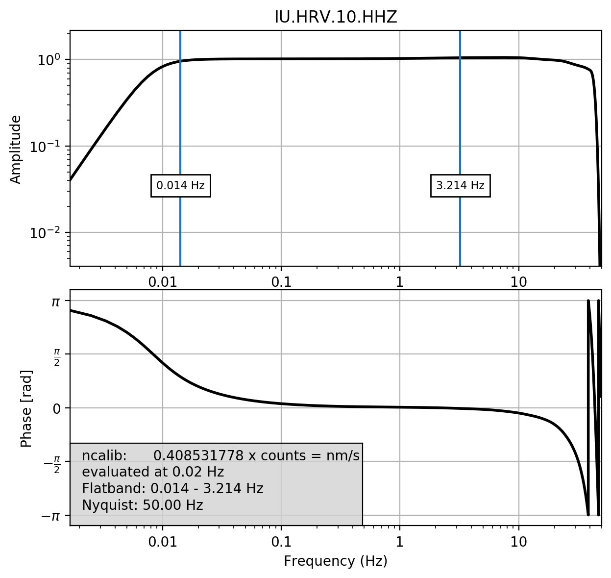

## StationXML_utils##

Plot the instrument response from a StationXML file, and report the sensitivities.

The script uses Obspy, and its evalresp utilities.

The bode plots default to 'Velocity', and the units to 'nm/s'.  

The flat part of the response passband as estimate to be +-5% of 1, after normalizing the response by the sensitivity value.

## Install ##

Clone source package  
`git clone http://github.com/flyrok/StationXML_utils`  

Install with pip after download  
`pip install .`  

Or install directly from github  
`pip install git+https://github.com/flyrok/StationXML_utils#egg=StationXML_utils`  

Or just put the executable on your PATH and call directly  
`./staxml_respinfo.py`

## Python Dependencies ##

python>=3.6  (script uses f-strings)  
obspy (https://github.com/obspy/obspy/wiki)
-- without this, nothing will work

## Usage ##

To see help:  
`staxml_respinfo --help`    

To see version:  
`staxml_respinfo --version`

To see a list of SEED ids in a StationXML file:  
`staxml_respinfo -i INPUT.staxml`  

To plot the response for SEED_id N4.K57A.00.HHZ:  
`staxml_respinfo -i INPUT.staxml -s N4.K57A.00.HHZ

To grab the response info for HRV and plot the HHZ response:
`fdsn_station_info -b 2019001T00 -e 2019100T00 -n IU -s HRV -c "HH?" -r`  
`staxml_respinfo -i sta_info.staxml -s IU.HRV.10.HHZ `  

Which produces:  

